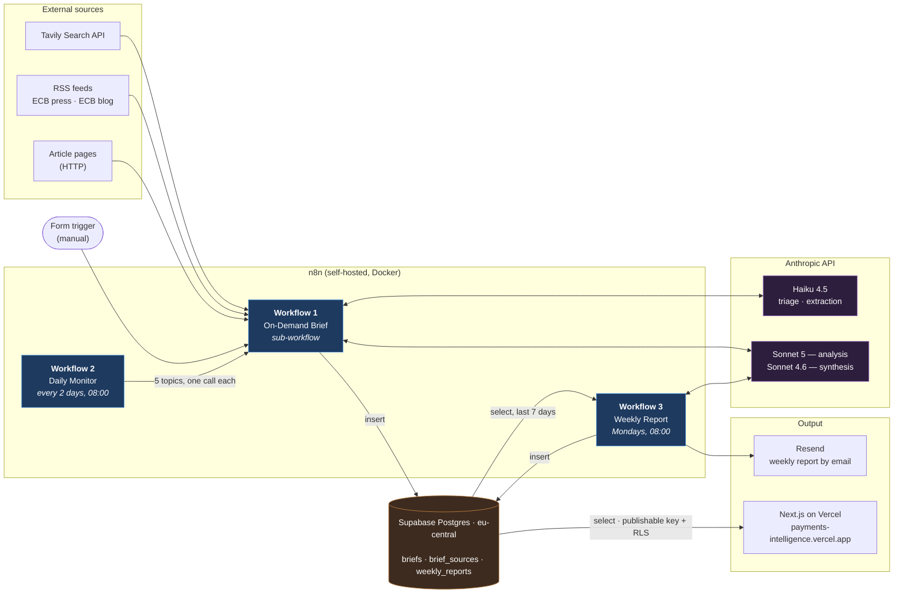
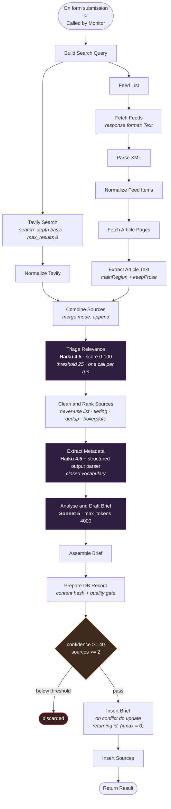
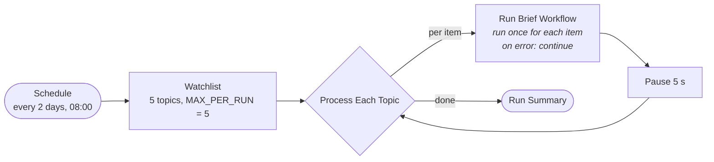
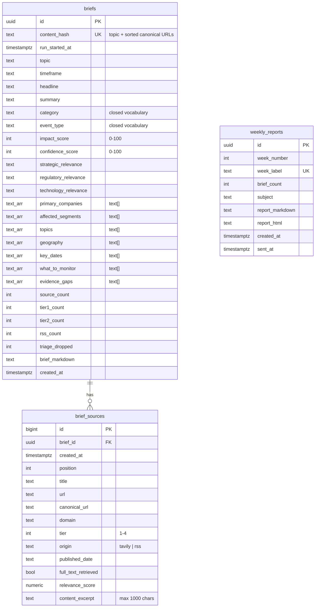
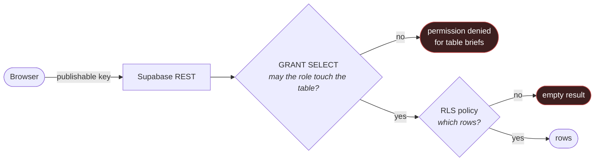

# Architecture

Three n8n workflows write into one Postgres database. The frontend reads from the same
database and never writes. No workflow calls another over HTTP — the scheduler embeds the
brief workflow as an n8n sub-workflow, so the analysis logic exists in exactly one place.

## System overview

## Models in use

Exact identifiers as configured in the workflow nodes today. Model choice follows
task difficulty and is not changed without a deliberate test.

| Node | Workflow | Model | max tokens | temperature |
|---|---|---|---|---|
| Triage Relevance | On-Demand Brief | `claude-haiku-4-5-20251001` | 1000 | 0 |
| Extract Metadata | On-Demand Brief | `claude-haiku-4-5-20251001` | 1500 | 0 |
| Analyse and Draft Brief | On-Demand Brief | `claude-sonnet-5` | 4000 | 0.2 |
| Synthesise Report | Weekly Report | `claude-sonnet-4-6` | 4000 | 0.3 |

The weekly synthesis still runs on Sonnet 4.6 while the brief pipeline is on
Sonnet 5. Aligning them is a pending, deliberate change — see `docs/progress.txt`.

## Workflow 1 — the brief pipeline

Two retrieval branches run in parallel and are merged, after which the sources pass through
a chain of filters ordered from *cheap and deterministic* to *expensive and model-based*.
Format and duplicate checks cost nothing and run first; the language model only scores what
survives them.

### Why this order

| Stage | Mechanism | What it checks |
|---|---|---|
| Normalize Tavily / Feed Items | rules | shape, origin tagging, topic keywords for RSS |
| Extract Article Text | rules | prose vs. navigation |
| Triage Relevance | Haiku | **topical relevance** — rules cannot do this |
| Clean and Rank Sources | rules | never-use domains, tiers, canonical-URL dedup, near-duplicate text, boilerplate |
| Extract Metadata | Haiku | companies, category, event type |
| Analyse and Draft Brief | Sonnet | meaning, thesis, framing |

Rules recognise **format**; models recognise **substance**. An intermediate attempt to
infer relevance from URL patterns (discard anything under `/news`) matched legitimate
article URLs and cut the source count from 9 to 2.

### Inside "Clean and Rank Sources"

Deterministic, in this order:

1. Apply triage scores; drop anything below 25. On a triage failure, keep everything —
   losing all sources is worse than keeping weak ones.
2. `NEVER_USE`: 15 user-generated-content domains, enforced in code regardless of what the
   search API returned.
3. Tier assignment (1–4) by domain suffix.
4. Topic keyword check — RSS only; search results are already topic-filtered.
5. Canonical URL: strip anchors, query strings, duplicate slashes, trailing slash, lowercase.
6. Duplicate elimination on canonical URL, then on a normalised 60-character title key,
   then on a normalised 200-character content prefix. The third catches wire copy
   republished under different headlines.
7. Boilerplate: two or more footer/navigation phrase matches, or three or more image
   placeholders, drops the source.
8. Structure test: over 40 words **and** over 60 words per sentence means a navigation
   list, not prose.

## Workflow 2 — Daily Monitor

Two settings are not optional:

- **Run once for each item** — otherwise all five topics arrive in a *single* call and
  `Build Search Query` only reads `$input.first()`.
- **On error: continue** — five topics are 15 API calls. If topic 3 fails, stopping the
  workflow would also suppress 4 and 5.

`MAX_PER_RUN` is a hard cost brake, not a convenience: it bounds the worst case per run
regardless of how long the watchlist grows.

## Workflow 3 — Weekly Report

The prompt is written as an editorial assignment — cluster, exclude, rank, connect — rather
than as a summarisation task. The report publishes a **coverage note** stating which briefs
it merged and which it dropped, and why.

## Data model

The dedup hash is computed over **topic + sorted canonical source URLs**, never over the
brief text: the model's prose differs slightly on every run, so a text hash would never
collide. `.sort()` is required because search engines do not return a stable ordering.

`on conflict do nothing` was the original form and was wrong: on a duplicate it returns no
row, so the follow-up source insert wrote `null` into a `not null` column.
`do update set topic = excluded.topic ... returning id, (xmax = 0) as was_inserted`
guarantees an id and reports whether the row was newly inserted.

All writes are parameterised (`$1`, `$2`, …) — values travel separately from the statement.

## Frontend access layers

Both layers must pass. Because *Automatically expose new tables* is deliberately off in the
Supabase project, the `GRANT` has to be issued by hand — an RLS policy alone is not enough,
and the resulting error (`permission denied for table briefs`) points at the wrong layer.

## Pages

| Route | Content |
|---|---|
| `/` | Feed — key figures, brief cards, impact colour-coded, confidence as a bar |
| `/brief/[id]` | Full brief, source list with tier, origin, headline-only marker, links to primary sources |
| `/companies` | Grouped by company, sorted by frequency |
| `/reports` | Weekly reports, newest first |
| `/about` | Method in six steps, score definitions, stated limitations |
